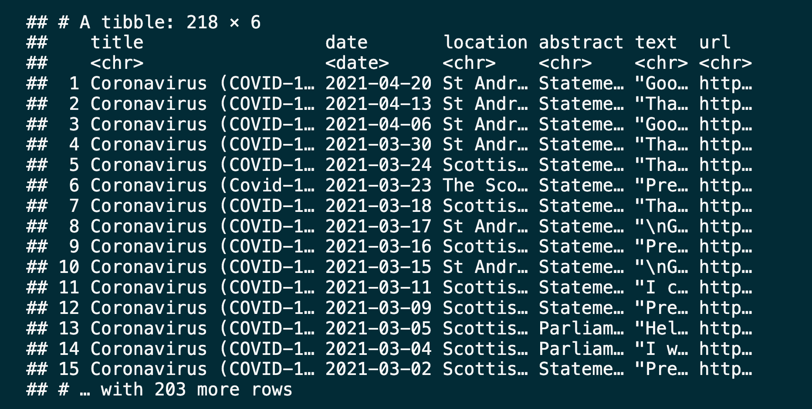
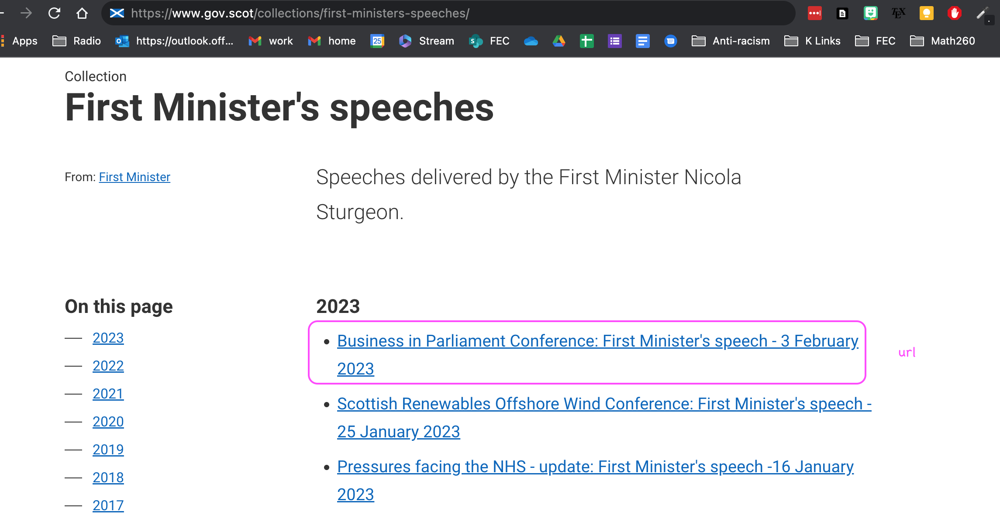

```{r setup, include=FALSE}
knitr::opts_chunk$set(echo = TRUE,message=FALSE,warning=FALSE, cache = TRUE)
```

```{r packages, echo=FALSE, message=FALSE, warning=FALSE}
library(tidyverse)
library(forcats)
library(lubridate)
library(rvest)
#library(backports)
```


# Agenda

* The pipe

* Introduction to Functions  

* Investigation: Applications to scraping

---

## The Household Pipe: GIGO? 


---

## Magritte's Pipe 


<div class="footnote">
Image taken from a University of Alabama site, "Approaches to Modernism": [1], Fair use, https://en.wikipedia.org/w/index.php?curid=555365
</div>

---
##  The Tidyverse Pipe  


---

## Why we need the pipe?  Violent rabbits??  

```{r, eval = FALSE}
foo_foo_1 <- hop(foo_foo, through = forest)
foo_foo_2 <- scoop(foo_foo_1, up = field_mice)
foo_foo_3 <- bop(foo_foo_2, on = head)
```

Stringing commands without the pipe leads to:

* Code cluttered with unimportant names  
    + But it's not about the use of memory  
* Need to keep track of object versions  
    + Sequential numbering like `lakers2`?  

---

## Overwriting names is problematic 

```{r, eval = FALSE}
foo_foo <- hop(foo_foo, through = forest)
foo_foo <- scoop(foo_foo, up = field_mice)
foo_foo <- bop(foo_foo, on = head)
```

* Need to rerun from the top when debugging  

* Code is hard to follow due to repetition    
    + What's changing each time?  

---
## Using the pipe! %>% 

```{r, eval = FALSE}
foo_foo %>%
  hop(through = forest) %>%
  scoop(up = field_mice) %>%
  bop(on = head) -> 
  the_output  
```

* Easy to follow  
* Focuses on actions  
* Avoids clutter and repitition  

---
## The Hadley-approved Version 

```{r, eval = FALSE}
# Easy to comment out the first line when debugging
the_output<- 
  foo_foo %>%
  hop(through = forest) %>%
  scoop(up = field_mice) %>%
  bop(on = head)
```

* Easy to follow  
* Focuses on actions  
* Avoids clutter and repitition  

---
## When to avoid the pipe?  

* Many steps that cannot be condensed further.   

* Multiple inputs/outputs (but you might want to learn about the tee "%T>%")

* Non-linear process


---
class: inverse, center, middle

# Functions  

---
## From Calculus  

* A function is a rule  

* For every input we can only get one output  

* Passes vertical line test  

```{r, echo = F, fig.height = 4, warning = FALSE}
x <- seq(-2, 6, .05)
y <- x^3 - 6*x^2 + 4*x + 12
plot(x, y, 
     type="l", 
     xaxt='n', yaxt='n', 
     bty='n', 
     xlab='', ylab='', 
     col="blue")
##  Next add in your axis arrows:
arrows(min(x), 0, max(x), 0, lwd=1, length=0.15)
arrows(0, min(y), 0, max(y), lwd=1, length=0.15)
##  And plot your x/y labels.  Note that if you want them
##    actually at the end of the arrows you would need to 
##    remove the pos= argument and shorten your arrows by
##    a small amount.  To match your original figure, you can
##    alter the x/y coordinate to be the max() instead.
text(0, max(y), "f(x)", pos=2)
text(max(x), 0, "x", pos=3)
#axis(1)
#axis(2)
```

---

## Functions in Computer Science

```{r, out.width = '30%', fig.align='center', fig.cap='',echo=FALSE}
knitr::include_graphics('figures/Function_machine2.svg.png')
```


---
## Why Functions?  

```{r}
#  x^2 - 5x - 14 = 0 
(-(-5) +c(-1,1)*sqrt((-5)^2 - 4*1*(-14)))/( 2*1) 
```

```{r}
# 2x^2 + 2x − 12 = 0
(-(2) +c(-1,1)*sqrt((2)^2 - 4*(2)*(-12)))/( 2*2) 
```

```{r}
#  x^2 - 4x + 4 = 0 
(-(-4) +c(-1,1)*sqrt((-4)^2 - 4*1*(4)))/( 2*1) 
```


---

## Write a Famous Function

```{r}
quad_roots <- function(aval, bval, cval){
  (-bval +c(-1,1)*sqrt(bval^2 - 4*aval*cval))/( 2*aval) 
}
quad_roots(1, -5, -14)  
quad_roots(2, 2, -12)  
quad_roots(1, -4, 4)  # Gives repeated roots
```

---
class: inverse, center, middle

# Functions and Automation: Scotland First Minister's COVID speeches

---


## Goal

Use to scrape all the first minister's speeches that contain COVID in the title and create a dataset of speeches containing the following information about the speeches:

1. Title

2. Date

3. Location

4. Abstract

5. Text of the speech

6. URL address of the speech

---

## Website Table of Contents 


---

## The Goal



---

## Getting Oriented

#### [https://www.gov.scot/collections/first-ministers-speeches/](https://www.gov.scot/collections/first-ministers-speeches/)



---


---
## Plan

1. Scrape `title`, `date`, `location`, `abstract`, and `text` from a few COVID-19 speech pages to develop the code

2. Write a function that scrapes `title`, `date`, `location`, `abstract`, and `text` from COVID-19 speech pages

3. Scrape the `url`s of COVID-19 speeches from the main page

4. Use this function to scrape from each individual COVID-19 speech from these `url`s and create a data frame with the columns `title`, `date`, `location`, `abstract`, `text`, and `url`

---
class:  middle

## 1. Scrape data from a few COVID-19 speech pages

---
background-image: url("figs/fm_speeches_picture_oct20.png")
background-size: 25%
background-position: 90% 90%

## Read page for  October 26, 2020 speech

```{r}
url <- "https://www.gov.scot/publications/coronavirus-covid-19-update-first-ministers-speech-26-october/"
speech_page <- read_html(url)
```

```{r}
speech_page
```

---

## Extract title

Use Selector Gadget to find the appropriate node

```{r}
title <- speech_page %>%
    html_node(".ds_page-header__title") %>%
    html_text()
title
```
---


## Extract date

* Use `dmy()` to format

```{r}
library(lubridate)
date <- speech_page %>%
    html_node("#sg-meta__publication-date") %>%
    html_text() %>%
  dmy()
date
```


---

## Extract location


```{r}
location <- speech_page %>%
    html_node(".ds_metadata__item:nth-child(5) strong") %>%
    html_text() 
location
```


---

## Extract abstract


```{r}
abstract <- speech_page %>%
    html_node(".ds_no-margin--bottom") %>%
    html_text() 
abstract
```


---

## Extract text


```{r}
text <- speech_page %>%
    html_node("#preamble p") %>%
    html_text() %>%
  list()
text
```


---

## Put it all in a data frame

```{r}
oct_26_speech <- tibble(
  title    = title,
  date     = date,
  location = location,
  abstract = abstract,
  text     = text,
  url      = url
)
oct_26_speech
```


---
# Your turn

### Can you create a similar function to access information on the Top Rated TV Shows on IMDB (there should be 250 on the list)?


.footnote[**IMPORTANT NOTE**: This exercise is intended to illustrate methods for using functions to obtain data from the web. For large scale automated processes, be sure to obtain permission from the web site you wish to scrape.]

---
# Acknowledgement  

Web scraping introduction to functions adapted from materials provided by [Data Science in a Box](https://datasciencebox.org/) at https://github.com/rstudio-education/datascience-box. 


